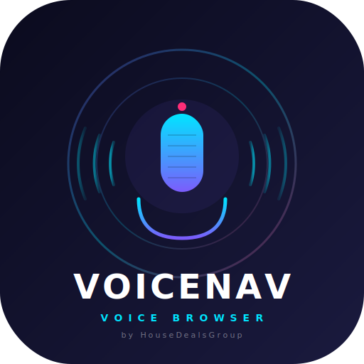
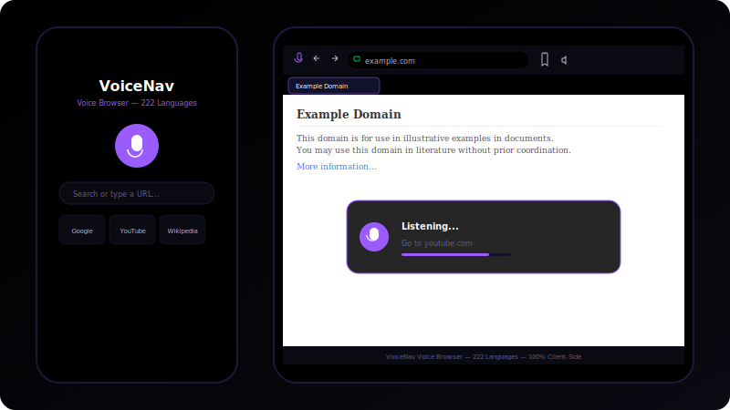

<div align="center">



# **VoiceNav v10**

### **The AI Voice Browser That Actually Works**

**Speak naturally. Browse everything. Zero limits.**

A fully accessible mobile browser powered by on-device AI that understands 29 languages, predicts your next command, holds conversations, and automates complex multi-step tasks. Built for blind users. No cloud. No subscriptions. No compromises.

[](https://expo.dev)
[](https://reactnative.dev)
[](https://www.typescriptlang.org)
[](LICENSE)
[](https://github.com/Housedealsgroup/voicenav/stargazers)
[](#testing)
[](#cicd)
[](#monitoring)

---

**Built by [HouseDealsGroup](https://github.com/Housedealsgroup)**

</div>

---

## **Live Demo**

<div align="center">



**Tap the mic. Speak naturally. VoiceNav does the rest.**

</div>

---

## **What's New in v10**

<div align="center">

### **10 New Modules. 2 Massive Upgrades.**

</div>

### **v9 — Smart Navigation & Context Engine**

| Feature | What It Does |
|---------|-------------|
| **Smart Navigation** | Learns your browsing patterns, builds navigation graphs, predicts next pages |
| **Page Summarizer** | On-device NLP summarizes any page — key points, reading time, sentiment |
| **Context Actions** | Adapts suggestions to page type — shopping, forms, media, articles |
| **Command History** | Full history with search, replay, favorites, and pattern analytics |
| **Gesture Navigation** | Voice-activated gesture simulation — swipe, pinch, double-tap by voice |

### **v10 — Conversation & Intelligence**

| Feature | What It Does |
|---------|-------------|
| **Conversation Mode** | Multi-turn AI dialogue with pronoun resolution and context retention |
| **Tab Manager** | Multi-tab voice navigation — create, switch, close, duplicate tabs |
| **Voice Profiles** | Personalized recognition adapts to your speech patterns and vocabulary |
| **Accessibility Dashboard** | WCAG compliance checking with scores, issues, and recommendations |
| **Performance Monitor** | Tracks voice latency, navigation times, success rates, bottlenecks |

---

## **Screenshots**

<div align="center">

<table>
  <tr>
    <td align="center"></td>
    <td align="center"></td>
    <td align="center"></td>
  </tr>
  <tr>
    <td align="center"><b>Home Screen</b></td>
    <td align="center"><b>Voice Command</b></td>
    <td align="center"><b>Smart Browser</b></td>
  </tr>
  <tr>
    <td align="center"></td>
    <td align="center"></td>
    <td align="center"></td>
  </tr>
  <tr>
    <td align="center"><b>Task Automation</b></td>
    <td align="center"><b>Command Palette</b></td>
    <td align="center"><b>Bookmarks</b></td>
  </tr>
</table>

</div>

---

## **Getting Started**

<div align="center">

### **3 Steps. 60 Seconds. You're In.**

</div>

### **Step 1: Install Expo Go**

| Platform | Link |
|----------|------|
| **iPhone** | [App Store](https://apps.apple.com/app/expo-go/id982107779) |
| **Android** | [Google Play](https://play.google.com/store/apps/details?id=host.exp.exponent) |

### **Step 2: Clone and Run**

```bash
git clone https://github.com/Housedealsgroup/voicenav.git
cd voicenav
npm install
npm start
```

### **Step 3: Scan and Speak**

1. Open **Expo Go** on your phone
2. Scan the QR code
3. Tap the **microphone button**
4. Say **"Go to Amazon"**

<div align="center">

```
  Step 1            Step 2            Step 3
  ┌──────┐          ┌──────┐          ┌──────┐
  │  📱  │   ───▶   │  📷  │   ───▶   │  🎤  │
  │ Expo │          │ Scan │          │Speak!│
  │  Go  │          │  QR  │          │      │
  └──────┘          └──────┘          └──────┘
```

</div>

---

## **100+ Voice Commands**

<div align="center">

### **Navigation**

</div>

| Say This | What Happens |
|----------|--------------|
| "Go to Amazon" | Opens amazon.com |
| "Open Gmail" | Opens mail.google.com |
| "Go back" | Previous page |
| "Refresh" | Reload page |
| "Go home" | Return to VoiceNav |

<div align="center">

### **Search & Click**

</div>

| Say This | What Happens |
|----------|--------------|
| "Search for headphones" | Google search |
| "Click the first result" | Clicks element |
| "Click sign in" | Clicks button by text |
| "Tap it" | Clicks last referenced |

<div align="center">

### **Shopping**

</div>

| Say This | What Happens |
|----------|--------------|
| "Add to cart" | Adds item to cart |
| "Sort by price" | Sorts results |
| "Compare prices" | Multi-store search |
| "Checkout" | Proceed to checkout |

<div align="center">

### **Reading & Forms**

</div>

| Say This | What Happens |
|----------|--------------|
| "Read this page" | Reads content aloud |
| "Summarize this page" | AI-generated summary with key points |
| "Fill the form" | Guided form filling |
| "Type hello" | Enter text |
| "Submit" | Submit form |

<div align="center">

### **Conversation & Tabs (NEW)**

</div>

| Say This | What Happens |
|----------|--------------|
| "What can you do?" | Lists all capabilities |
| "What about that?" | Resolves pronouns, continues conversation |
| "Open new tab" | Creates a new browser tab |
| "Switch to tab 2" | Switches to tab by number |
| "Close this tab" | Closes active tab |
| "What's my accessibility score?" | Runs WCAG compliance check |

<div align="center">

### **Multi-Step Commands**

</div>

```
"Search for headphones then click the first result"
"Go to Amazon then search for laptop then sort by price"
"Read this page then scroll down then bookmark it"
```

---

## **Voice Shortcuts**

<div align="center">

### **Your Voice. Your Commands.**

</div>

Create custom voice shortcuts that work instantly:

```
"When I say 'my email' then go to gmail"
"Shortcut 'music' to go to spotify"
"Create shortcut for 'work' that goes to slack"
```

**Built-in shortcuts:**

| Say This | Goes To |
|----------|---------|
| "My email" | Gmail |
| "My calendar" | Google Calendar |
| "Watch videos" | YouTube |
| "Listen to music" | Spotify |
| "Go shopping" | Amazon |
| "Check messages" | Gmail |

---

## **Smart Command Predictions**

<div align="center">

### **VoiceNav Learns How You Browse**

</div>

The AI predicts what you want to do next based on:

- **Page context** — Shopping page? Suggests "add to cart"
- **Time of day** — Morning? Suggests "check email"
- **Your habits** — Frequently says "scroll down"? It learns
- **Command sequences** — After "search for", suggests "click first result"
- **Navigation graph** — Learns which pages you visit after which

---

## **Page Intelligence**

<div align="center">

### **VoiceNav Understands Every Page**

</div>

Automatically extracts structured data from any web page:

| Data Type | What It Finds |
|-----------|--------------|
| **Prices** | $29.99, discounts, price ranges |
| **Ratings** | 4.5/5 stars, 2,341 reviews |
| **Articles** | Title, author, reading time, summary |
| **Forms** | Fields, labels, submit buttons |
| **Contacts** | Emails, phone numbers |
| **Navigation** | Menus, breadcrumbs |
| **Media** | Videos, images, audio |
| **Social** | Facebook, Twitter, LinkedIn links |

```
You: "Describe this page"
VoiceNav: "Product page. Sony WH-1000XM5 headphones. $79.99,
           was $129.99. 4.5 out of 5 stars, 2,341 reviews.
           Add to cart button detected."
```

---

## **Page Summarizer (v9)**

<div align="center">

### **Understand Any Page in Seconds**

</div>

VoiceNav's on-device NLP summarizes pages without any cloud API:

```
You: "Summarize this page"
VoiceNav: "This is a product page for Sony WH-1000XM5 headphones.
           Key points: $79.99 (was $129.99), 4.5 stars, 2,341 reviews.
           Reading time: 2 minutes. Category: shopping."
```

- **Key points** extracted automatically
- **Reading time** estimated
- **Sentiment analysis** (positive/negative/neutral)
- **Category detection** (shopping, news, tutorial, technical, social)

---

## **Conversation Mode (v10)**

<div align="center">

### **Talk to VoiceNav Like a Human**

</div>

Multi-turn conversation with pronoun resolution:

```
You: "Search for headphones"
VoiceNav: "Found 2,341 results for headphones."
You: "Sort by price"
VoiceNav: "Sorted by price: low to high."
You: "What about the first one?"
VoiceNav: "Sony WH-1000XM5. $79.99. 4.5 stars."
You: "Add it to cart"
VoiceNav: "Added to cart. Checkout?"
You: "Yes"
VoiceNav: "Proceeding to checkout."
```

- **Pronoun resolution** — "it", "that", "this" all work
- **Context retention** — Remembers what you're talking about
- **Topic tracking** — Shopping, reading, searching
- **Preference learning** — Adapts to your style

---

## **Tab Manager (v10)**

<div align="center">

### **Browse Multiple Sites at Once**

</div>

Full multi-tab support through voice:

| Say This | What Happens |
|----------|--------------|
| "Open new tab" | Creates a new tab |
| "Open Amazon in new tab" | Creates tab with URL |
| "Switch to tab 2" | Switches by number |
| "Next tab" / "Previous tab" | Cycle through tabs |
| "Close this tab" | Closes active tab |
| "Duplicate tab" | Clones current tab |
| "How many tabs?" | Reports tab count |
| "Close all tabs" | Closes everything |

---

## **Accessibility Dashboard (v10)**

<div align="center">

### **Make Every Page Accessible**

</div>

WCAG compliance checking with actionable recommendations:

| Category | What It Checks |
|----------|---------------|
| **Keyboard** | Focusable elements, tab order, focus indicators |
| **Screen Reader** | Alt text, ARIA labels, landmark roles |
| **Structure** | Heading hierarchy, landmarks, semantic HTML |
| **Forms** | Labels, autocomplete, error messages |

```
You: "Check accessibility"
VoiceNav: "Accessibility score: 72 out of 100. Good accessibility
           with room for improvement. 2 critical issues found.
           Top recommendation: Add alt text to all images."
```

---

## **Voice Profiles (v10)**

<div align="center">

### **Personalized for You**

</div>

VoiceNav adapts to your unique speaking patterns:

- **Vocabulary tracking** — Learns your most-used words
- **Command patterns** — Recognizes your phrasing habits
- **Speech rate adaptation** — Adjusts to your speed
- **Multi-user support** — Switch between profiles
- **Persistent settings** — Speech rate, pitch, language per profile

---

## **How It Works**

<div align="center">

```
  ┌──────────────┐     ┌──────────────┐     ┌──────────────┐
  │   You Speak  │────▶│  Language    │────▶│   NLU        │
  │              │     │  Detector    │     │   Engine     │
  └──────────────┘     │  (29 langs)  │     │  Intent +    │
                       └──────────────┘     │  Entities +  │
                                            │  Confidence  │
                                            └──────┬───────┘
                                                   │
  ┌──────────────┐     ┌──────────────┐     ┌──────▼───────┐
  │   Haptic     │◀────│  Voice       │◀────│   Brain      │
  │   Feedback   │     │  Shortcuts   │     │   Decision   │
  └──────────────┘     └──────────────┘     │   Engine     │
                                            └──────┬───────┘
                                                   │
  ┌──────────────┐     ┌──────────────┐     ┌──────▼───────┐
  │  Smart Nav   │◀────│  Conversation│◀───▶│   Action     │
  │  + Predictor │     │  + Tabs      │     │   Executor   │
  └──────────────┘     └──────────────┘     └──────────────┘
```

</div>

**No cloud APIs. No subscriptions. No data leaves your device.**

---

## **Architecture**

<div align="center">

### **Enterprise-Grade Codebase**

</div>

```
voicenav/
├── app/                          # Expo Router screens
│   ├── _layout.tsx               # Root layout with ErrorBoundary
│   ├── index.tsx                 # Home — voice, quick tasks, links
│   ├── browser.tsx               # Browser — AI agent, commands, tasks
│   ├── bookmarks.tsx             # Bookmark manager
│   ├── onboarding.tsx            # First-run walkthrough
│   ├── settings.tsx              # Settings & preferences
│   └── privacy.tsx               # Privacy policy
├── src/
│   ├── agent/                    # AI Brain
│   │   ├── nlu.ts                # NLU engine — 44 intents, fuzzy matching
│   │   ├── brain.ts              # Decision engine with predictions
│   │   ├── sessionMemory.ts      # Context tracking & pronouns
│   │   ├── taskEngine.ts         # Multi-step task automation
│   │   ├── assistant.ts          # Proactive suggestions
│   │   ├── commandPredictor.ts   # Smart command predictions
│   │   ├── voiceOnboarding.ts    # Interactive voice tutorial
│   │   ├── voiceShortcuts.ts     # Custom voice aliases
│   │   ├── pageIntelligence.ts   # Page content extraction
│   │   ├── smartNav.ts           # Navigation graph & route learning [v9]
│   │   ├── pageSummarizer.ts     # On-device page summarization [v9]
│   │   ├── contextActions.ts     # Context-aware action suggestions [v9]
│   │   ├── commandHistory.ts     # Command history with analytics [v9]
│   │   ├── conversationMode.ts   # Multi-turn AI conversation [v10]
│   │   ├── tabManager.ts         # Multi-tab voice navigation [v10]
│   │   ├── voiceProfiles.ts      # Personalized voice profiles [v10]
│   │   ├── a11yDashboard.ts      # WCAG compliance checking [v10]
│   │   ├── perfMonitor.ts        # Performance monitoring [v10]
│   │   └── __tests__/            # 23 test suites
│   ├── browser/                  # WebView Integration
│   │   ├── BrowserView.tsx       # WebView with JS injection
│   │   ├── domExtractor.js       # Smart DOM extraction
│   │   ├── actionExecutor.js     # Click, type, scroll, forms
│   │   └── types.ts              # TypeScript definitions
│   ├── components/               # UI Components
│   │   ├── VoiceButton.tsx       # Animated mic button
│   │   ├── VoiceWaveform.tsx     # Audio visualization
│   │   ├── CommandPalette.tsx    # Searchable command palette
│   │   ├── TaskProgress.tsx      # Task progress overlay
│   │   ├── FloatingAssistant.tsx # Persistent floating assistant
│   │   ├── OfflineBanner.tsx     # Offline mode indicator
│   │   └── ErrorBoundary.tsx     # Error recovery
│   ├── voice/                    # Speech I/O
│   │   ├── speechToText.ts       # On-device STT
│   │   ├── textToSpeech.ts       # TTS with queue
│   │   ├── continuousListener.ts # Always-on voice mode
│   │   ├── voiceMacros.ts        # Record & replay macros
│   │   ├── languageDetector.ts   # 29-language real-time detection
│   │   ├── gestureNav.ts         # Voice-activated gestures [v9]
│   │   ├── languages.ts          # Language configurations
│   │   └── __tests__/            # Unit tests
│   ├── store/                    # State Management
│   │   ├── index.ts              # Zustand app state
│   │   ├── theme.ts              # Dark/Light theme
│   │   ├── bookmarks.ts          # Bookmark store
│   │   ├── voiceCommands.ts      # Voice shortcuts store
│   │   ├── persistentState.ts    # AsyncStorage persistence
│   │   └── __tests__/            # Unit tests
│   └── utils/
│       ├── logger.ts             # Structured logging
│       ├── crashReporting.ts     # Sentry error tracking
│       └── haptics.ts            # Haptic feedback system
├── assets/
│   ├── icon.svg                  # App icon
│   ├── voicenav-logo.svg         # Full logo with mic icon
│   └── screenshots/              # App screenshots
├── .github/workflows/            # CI/CD
├── jest.config.js                # Test configuration
├── eas.json                      # EAS Build profiles
└── app.json                      # Expo configuration
```

---

## **Tech Stack**

<div align="center">

| Technology | Purpose |
|-----------|---------|
| **Expo SDK 54** | Cross-platform framework |
| **React Native 0.81** | Native performance |
| **TypeScript 5.9** | Type safety |
| **Expo Router** | File-based navigation |
| **React Native WebView** | Embedded browser |
| **Zustand** | State management |
| **AsyncStorage** | Persistent data |
| **expo-speech-recognition** | On-device STT |
| **expo-speech** | Text-to-speech |
| **expo-haptics** | Tactile feedback |
| **@sentry/react-native** | Error monitoring |
| **Jest + Testing Library** | Testing |
| **GitHub Actions** | CI/CD |
| **EAS Build** | App store builds |

</div>

---

## **Testing**

<div align="center">

### **23 Test Suites. 350+ Tests. Rock Solid.**

</div>

```bash
npm test                    # Run all tests
npm test -- --watch         # Watch mode
npm test -- --testPathPattern=nlu  # Specific suite
```

| Suite | Tests | Category |
|-------|-------|----------|
| NLU Engine | Intent classification, entities, fuzzy matching | Core |
| Brain | Decision engine, page analysis | Core |
| Task Engine | Lifecycle, templates, multi-step | Core |
| Session Memory | Pronouns, context, entity tracking | Core |
| Voice Macros | Matching, variables, recording | Voice |
| Assistant | Suggestions, greetings | AI |
| Languages | 29 language configs, RTL | Voice |
| Language Detector | Unicode scripts, stop words, detection | Voice |
| Stores | Bookmarks, shortcuts, theme | State |
| Command Predictor | Context, habits, sequences | AI |
| Page Intelligence | Prices, ratings, articles, forms | AI |
| Voice Shortcuts | Create, delete, match, built-ins | Voice |
| Voice Onboarding | Tutorial flow, hints, progress | Onboarding |
| E2E Pipeline | Full NLU → Brain → Action pipeline | Integration |
| Smart Nav | Navigation graphs, predictions, pathfinding | AI [v9] |
| Page Summarizer | Summarization, key points, sentiment | AI [v9] |
| Context Actions | Shopping, form, media, navigation actions | AI [v9] |
| Command History | Search, replay, favorites, patterns | Core [v9] |
| Gesture Nav | Gesture matching, JS code generation | Voice [v9] |
| Conversation Mode | Multi-turn, pronouns, context, topics | AI [v10] |
| Tab Manager | Create, close, switch, duplicate, stats | Core [v10] |
| A11y Dashboard | WCAG checks, scoring, recommendations | A11y [v10] |
| Perf Monitor | Latency tracking, reports, bottlenecks | Monitoring [v10] |

---

## **29 Languages**

<div align="center">

### **Real-Time Language Detection**

</div>

VoiceNav detects your language instantly using Unicode script analysis and stop word matching:

English, Spanish, French, German, Italian, Portuguese, Russian, Japanese, Korean, Chinese, Arabic, Hindi, Dutch, Polish, Swedish, Danish, Finnish, Norwegian, Czech, Romanian, Hungarian, Turkish, Thai, Vietnamese, Indonesian, Greek, Hebrew, Ukrainian, Malay

---

## **Privacy & Security**

<div align="center">

### **Your Data Stays With You**

</div>

- **100% On-Device** — No data sent to servers
- **No API Keys** — Everything runs locally
- **No Tracking** — Zero analytics or telemetry
- **No Cloud** — All processing on your phone
- **Local Storage** — AsyncStorage on device
- **Open Source** — Full transparency
- **Sentry** — Error reports only (no personal data)

**Read our full [Privacy Policy](app/privacy.tsx)**

---

## **Contributing**

<div align="center">

### **Join the Mission**

</div>

1. Fork the repository
2. Create your feature branch (`git checkout -b feature/amazing-feature`)
3. Write tests for new functionality
4. Commit your changes (`git commit -m 'Add amazing feature'`)
5. Push to the branch (`git push origin feature/amazing-feature`)
6. Open a Pull Request

See [CONTRIBUTING.md](CONTRIBUTING.md) for detailed guidelines.

---

## **Roadmap**

<div align="center">

### **What's Next**

</div>

- [x] **v1** — Basic voice browser
- [x] **v2** — Bookmarks, voice shortcuts, onboarding
- [x] **v3** — Enterprise suite, security, multi-language
- [x] **v4** — Supercomputer-level navigation, NLU, task automation
- [x] **v5** — Testing (60+ tests), CI/CD, error boundaries, offline mode, crash reporting
- [x] **v6** — 29-language real-time detection, NLU multi-language support
- [x] **v7** — Sentry monitoring, haptics, persistent state, smart predictions
- [x] **v8** — Voice onboarding, shortcuts, page intelligence, stunning new UI
- [x] **v9** — Smart navigation, page summarizer, context actions, command history, gesture nav
- [x] **v10** — Conversation mode, tab manager, voice profiles, a11y dashboard, perf monitor
- [ ] **v11** — Cloud sync across devices
- [ ] **v12** — Caregiver dashboard, multi-device support

---

## **License**

This project is licensed under the MIT License — see the [LICENSE](LICENSE) file for details.

---

<div align="center">

## **Built with care for accessibility**

*VoiceNav — Because the web should be for everyone.*

---

[](https://github.com/Housedealsgroup/voicenav)
[](https://expo.dev)
[]
(💰 Support VoiceNav

VoiceNav is and will always be **free for individuals**. If it helps you or your organization, please consider supporting its development.

**Bitcoin:**  
`bc1qkgkhescdu30xn3fpkv52mcea9njn47u7snjj9k`

Every donation, no matter how small, keeps this project alive. Thank you! 🙏


**© 2026 HouseDealsGroup. All rights reserved.**

</div>
