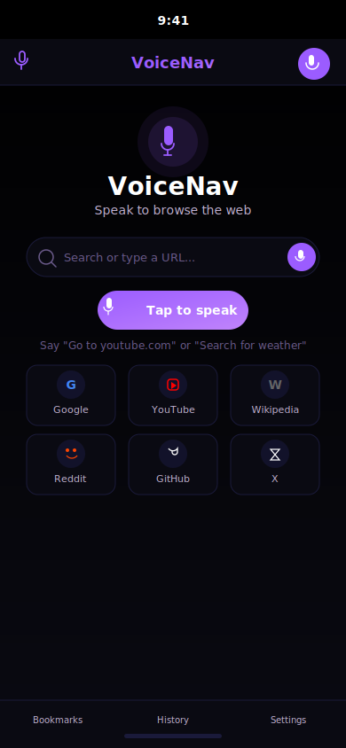
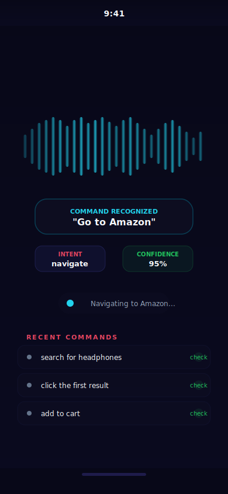
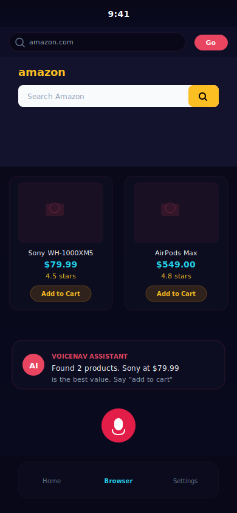
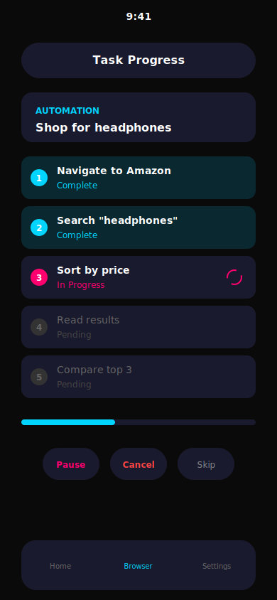
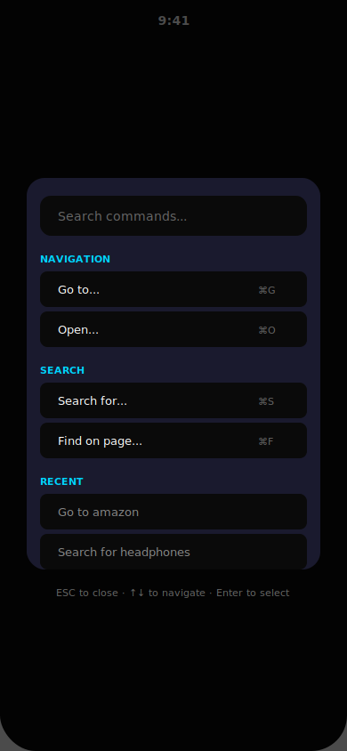
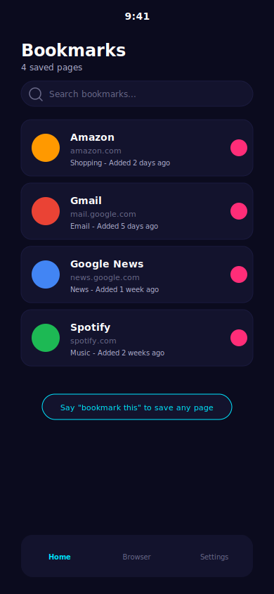
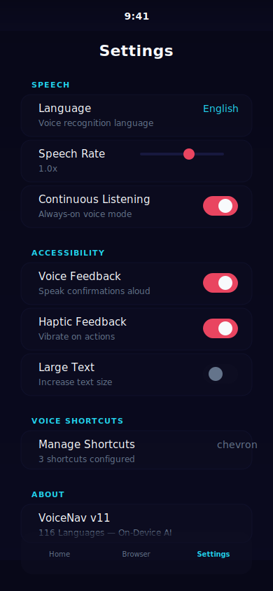

<div align="center">


# **VoiceNav**

### **The Future of Accessible Browsing**

**Speak naturally. Get things done. One button. Zero limits.**

A fully accessible mobile browser that understands your voice and completes complex tasks automatically. Built for blind users. Powered by on-device AI. No cloud. No subscriptions. No compromises.

[](https://expo.dev)
[](https://reactnative.dev)
[](https://www.typescriptlang.org)
[](LICENSE)
[](https://github.com/Housedealsgroup/voicenav/stargazers)
[](#testing)
[](#cicd)

---

**Built by [GITLAWB](https://github.com/Housedealsgroup) · Powered by [MIMO](https://github.com/Housedealsgroup) · Backed by [APOLLO BTC](https://github.com/Housedealsgroup)**

</div>

---

## **Watch the Demo**

<div align="center">

[](https://youtube.com/watch?v=YOUR_VIDEO_ID)

*One tap. One voice command. The entire web at your command.*

</div>

---

## **Screenshots**

<div align="center">

<table>
  <tr>
    <td align="center"></td>
    <td align="center"></td>
    <td align="center"></td>
  </tr>
  <tr>
    <td align="center"><b>Home Screen</b></td>
    <td align="center"><b>Voice Command</b></td>
    <td align="center"><b>Smart Browser</b></td>
  </tr>
  <tr>
    <td align="center"></td>
    <td align="center"></td>
    <td align="center"></td>
  </tr>
  <tr>
    <td align="center"><b>Task Automation</b></td>
    <td align="center"><b>Command Palette</b></td>
    <td align="center"><b>Bookmarks</b></td>
  </tr>
</table>



**Settings**

</div>

---

## **What Makes VoiceNav Different**

<div align="center">

| Feature | VoiceNav | Other Browsers |
|---------|----------|----------------|
| **Voice Control** | 100+ natural language commands | Limited or none |
| **AI Processing** | 100% on-device | Cloud-based, privacy risk |
| **Task Automation** | Multi-step with state machine | Single action only |
| **Session Memory** | Context-aware pronouns | No memory |
| **Continuous Listening** | Always-on with wake word | Manual activation only |
| **Voice Macros** | Record & replay sequences | Not available |
| **Accessibility** | Built for blind users first | Afterthought |
| **Privacy** | Zero data collection | Telemetry & tracking |
| **Cost** | Free & open source | Proprietary |

</div>

---

## **Quick Start**

<div align="center">

### **Get Running in 60 Seconds**

</div>

```bash
# Clone the repo
git clone https://github.com/Housedealsgroup/voicenav.git
cd voicenav

# Install dependencies
npm install

# Start the app
npm start
```

<div align="center">

```
┌─────────────────────────────────────────────────┐
│                                                 │
│   📱  Install Expo Go on your phone             │
│       │                                         │
│       ▼                                         │
│   📷  Scan the QR code                          │
│       │                                         │
│       ▼                                         │
│   🎤  Tap the mic and speak                     │
│       │                                         │
│       ▼                                         │
│   ✅  VoiceNav does the rest                    │
│                                                 │
└─────────────────────────────────────────────────┘
```

</div>

---

## **How It Works**

<div align="center">

```
  ┌─────────────┐     ┌──────────────┐     ┌──────────────┐
  │  You Speak  │────▶│  NLU Engine  │────▶│   Decision   │
  │  or Type    │     │  Intent +    │     │   Engine     │
  └─────────────┘     │  Entities +  │     │  (brain.ts)  │
                      │  Confidence  │     └──────┬───────┘
                      └──────────────┘            │
                                                   ▼
  ┌─────────────┐     ┌──────────────┐     ┌──────────────┐
  │  You Hear   │◀────│  Text-to-    │◀────│   Action     │
  │  Feedback   │     │  Speech      │     │   Executor   │
  └─────────────┘     └──────────────┘     └──────┬───────┘
                                                   │
                      ┌──────────────┐            ▼
                      │  Session     │     ┌──────────────┐
                      │  Memory      │◀───▶│  DOM Extract │
                      │  (context)   │     │  (WebView)   │
                      └──────────────┘     └──────────────┘
```

</div>

1. **You speak** — VoiceNav captures your command via on-device speech-to-text
2. **NLU processes** — Intent classification, entity extraction, confidence scoring
3. **Context resolves** — Session memory resolves pronouns and references
4. **Brain decides** — The decision engine selects the best action
5. **Action executes** — Click, type, scroll, navigate in the WebView
6. **You hear feedback** — Text-to-speech confirms every action
7. **Memory updates** — Session context tracks what happened

**No cloud APIs. No subscriptions. No data leaves your device.**

---

## **100+ Voice Commands**

<div align="center">

### **Navigation**

</div>

| Say This | What Happens |
|----------|--------------|
| "Go to Amazon" | Navigates to amazon.com |
| "Open Gmail" | Opens mail.google.com |
| "Visit GitHub" | Opens github.com |
| "Go back" | Navigates to previous page |
| "Go forward" | Navigates forward |
| "Refresh the page" | Reloads current page |
| "Go home" | Returns to VoiceNav home |

<div align="center">

### **Search**

</div>

| Say This | What Happens |
|----------|--------------|
| "Search for headphones" | Google search for headphones |
| "Find wireless mouse" | Searches for wireless mouse |
| "Look up React Native" | Searches for React Native |
| "What is machine learning" | Searches for definition |
| "Who is Elon Musk" | Searches for person |

<div align="center">

### **Click & Interact**

</div>

| Say This | What Happens |
|----------|--------------|
| "Click sign in" | Clicks the sign in button |
| "Tap the first result" | Clicks first clickable element |
| "Click it" | Clicks last referenced element |
| "Press submit" | Clicks submit button |
| "Select the third option" | Selects third option |

<div align="center">

### **Shopping**

</div>

| Say This | What Happens |
|----------|--------------|
| "Add to cart" | Clicks add to cart button |
| "Buy this" | Clicks buy/purchase button |
| "Sort by price" | Sorts results by price |
| "Filter results" | Opens filter options |
| "Compare prices" | Searches multiple stores |
| "Checkout" | Proceeds to checkout |

<div align="center">

### **Reading**

</div>

| Say This | What Happens |
|----------|--------------|
| "Read this page" | Reads page content aloud |
| "Summarize" | Reads page summary |
| "Describe this page" | Describes what's on screen |
| "Scroll down" | Scrolls page down |
| "Scroll up" | Scrolls page up |
| "What's on screen" | Describes visible elements |

<div align="center">

### **Forms**

</div>

| Say This | What Happens |
|----------|--------------|
| "Fill the form" | Starts form filling flow |
| "Type hello" | Types text in focused field |
| "Enter john@example.com" | Types email address |
| "Submit" | Submits the form |
| "Sign up" | Clicks sign up button |

<div align="center">

### **Multi-Step Commands**

</div>

Chain commands with **"then"**:

```
"Search for headphones then click the first result"
"Go to Amazon then search for laptop then sort by price"
"Read this page then scroll down then read again"
```

---

## **Task Automation**

<div align="center">

### **Built-in Task Templates**

</div>

| Command | What VoiceNav Does |
|---------|-------------------|
| "Shop for headphones on Amazon" | Navigates → Searches → Reads results → Compares prices |
| "Compare prices for laptop" | Searches Google → Opens top results → Compares |
| "Check my email" | Opens Gmail → Reads inbox → Summarizes |
| "Read news" | Opens Google News → Reads headlines |
| "Watch YouTube" | Opens YouTube → Reads trending |
| "Fill form" | Detects fields → Guides input → Submits |

<div align="center">

### **Task Progress Tracking**

</div>

VoiceNav shows real-time progress for multi-step tasks:

```
✅ Step 1: Navigate to Amazon
✅ Step 2: Search "headphones"
⏳ Step 3: Sort by price
⬜ Step 4: Read results
⬜ Step 5: Compare top 3
```

Pause, resume, or cancel tasks at any time.

---

## **Voice Macros**

<div align="center">

### **Record & Replay**

</div>

Record sequences of commands and replay them with a single phrase:

```
"Start morning routine"
  → Check email → Read news → Check weather

"Amazon shop for headphones"
  → Navigate to Amazon → Search → Read results

"Compare prices for laptop"
  → Search Google → Open results → Compare
```

<div align="center">

### **Built-in Macros**

</div>

| Macro | Trigger Phrase |
|-------|---------------|
| Morning Routine | "morning routine" |
| Quick Amazon Shop | "amazon shop for [item]" |
| Check Email | "check email" |
| Read News | "read news" |
| Watch YouTube | "watch youtube" |
| Compare Prices | "compare prices for [item]" |

---

## **Continuous Listening**

<div align="center">

### **Always-On Voice Mode**

</div>

Enable continuous listening to use VoiceNav hands-free:

- **Wake Word** — Say "Hey VoiceNav" to activate
- **Always On** — Constantly listening for commands
- **Barge-In** — Interrupt VoiceNav mid-speech with a new command
- **Silence Detection** — Auto-stops after 3 seconds of silence

---

## **Session Memory**

<div align="center">

### **Context-Aware Intelligence**

</div>

VoiceNav remembers what you've done and understands context:

```
You: "Search for headphones"
VoiceNav: "Searching for headphones"

You: "Click the first one"
VoiceNav: "Clicking Sony WH-1000XM5"

You: "Add it to cart"
VoiceNav: "Adding Sony WH-1000XM5 to cart"
```

Pronouns like "it", "that", "the first one" are resolved automatically.

---

## **60+ Site Aliases**

<div align="center">

### **Just Say the Name**

</div>

| Say This | Goes To |
|----------|---------|
| "amazon" | amazon.com |
| "google" | google.com |
| "gmail" | mail.google.com |
| "youtube" | youtube.com |
| "github" | github.com |
| "twitter" | twitter.com |
| "reddit" | reddit.com |
| "netflix" | netflix.com |
| "spotify" | spotify.com |
| "news" | news.google.com |
| "weather" | weather.com |
| "maps" | maps.google.com |

---

## **25+ Languages**

<div align="center">

### **Global Accessibility**

</div>

Full voice support for: English, Spanish, French, German, Italian, Portuguese, Russian, Japanese, Korean, Chinese, Arabic, Hindi, Dutch, Polish, Swedish, Danish, Finnish, Norwegian, Czech, Romanian, Hungarian, Turkish, Thai, Vietnamese, Indonesian, Greek, Hebrew

---

## **Architecture**

<div align="center">

### **Enterprise-Grade Codebase**

</div>

```
voicenav/
├── app/                          # Expo Router screens
│   ├── _layout.tsx               # Root layout with ErrorBoundary
│   ├── index.tsx                 # Home — voice, quick tasks, links
│   ├── browser.tsx               # Browser — AI agent, commands, tasks
│   ├── bookmarks.tsx             # Bookmark manager
│   ├── onboarding.tsx            # First-run walkthrough
│   ├── settings.tsx              # Settings & preferences
│   └── privacy.tsx               # Privacy policy
├── src/
│   ├── agent/                    # AI Brain
│   │   ├── nlu.ts                # NLU engine — intent, entities, confidence
│   │   ├── brain.ts              # Decision engine — action selection
│   │   ├── sessionMemory.ts      # Conversation context & tracking
│   │   ├── taskEngine.ts         # Multi-step task automation
│   │   ├── assistant.ts          # Proactive suggestions
│   │   └── __tests__/            # Unit tests (8 suites, 60+ tests)
│   ├── browser/                  # WebView Integration
│   │   ├── BrowserView.tsx       # WebView wrapper with JS injection
│   │   ├── domExtractor.js       # Smart DOM extraction
│   │   ├── actionExecutor.js     # Click, type, scroll, form fill
│   │   └── types.ts              # TypeScript definitions
│   ├── components/               # UI Components
│   │   ├── VoiceButton.tsx       # Animated mic button
│   │   ├── VoiceWaveform.tsx     # Audio visualization
│   │   ├── CommandPalette.tsx    # Searchable command palette
│   │   ├── TaskProgress.tsx      # Task progress overlay
│   │   ├── FloatingAssistant.tsx # Persistent floating assistant
│   │   └── ErrorBoundary.tsx     # Error recovery component
│   ├── voice/                    # Speech I/O
│   │   ├── speechToText.ts       # On-device STT
│   │   ├── textToSpeech.ts       # TTS with queue
│   │   ├── continuousListener.ts # Always-on voice mode
│   │   ├── voiceMacros.ts        # Record & replay macros
│   │   ├── languages.ts          # 25+ language support
│   │   └── __tests__/            # Unit tests
│   ├── store/                    # State Management (Zustand)
│   │   ├── index.ts              # App state
│   │   ├── theme.ts              # Dark/Light theme
│   │   ├── bookmarks.ts          # Persistent bookmarks
│   │   ├── voiceCommands.ts      # Voice shortcuts
│   │   └── __tests__/            # Unit tests
│   └── utils/
│       └── logger.ts             # Structured logging
├── .github/workflows/            # CI/CD
│   ├── ci.yml                    # Lint, typecheck, test
│   └── eas-build.yml             # EAS Build on tags
├── jest.config.js                # Test configuration
├── jest.setup.js                 # Native module mocks
├── eas.json                      # EAS Build profiles
├── CONTRIBUTING.md               # Contribution guide
└── app.json                      # Expo configuration
```

---

## **Tech Stack**

<div align="center">

| Technology | Purpose |
|-----------|---------|
| **Expo SDK 54** | Cross-platform React Native framework |
| **React Native 0.81** | Native mobile performance |
| **TypeScript 5.9** | Type-safe development |
| **Expo Router** | File-based navigation |
| **React Native WebView** | Embedded browser with JS injection |
| **Zustand** | Lightweight state management |
| **expo-speech-recognition** | On-device speech-to-text |
| **expo-speech** | Text-to-speech |
| **Jest + Testing Library** | Unit & integration testing |
| **GitHub Actions** | CI/CD pipeline |
| **EAS Build** | App store builds |

</div>

---

## **Use Cases**

<div align="center">

### **For Blind & Visually Impaired Users**

</div>

- **Browse the web** — Navigate any website by voice
- **Shop online** — Compare prices, read reviews, checkout
- **Read content** — Articles, emails, news read aloud
- **Fill forms** — Sign up, log in, complete forms hands-free
- **Stay informed** — News, weather, stocks via voice

<div align="center">

### **For Hands-Busy Users**

</div>

- **Cooking** — Look up recipes without touching phone
- **Driving** — Get directions, send messages (safely)
- **Exercise** — Control music, check stats while moving
- **Working** — Multitask without switching focus

<div align="center">

### **For Elderly Users**

</div>

- **Simple interface** — One button to press, speak naturally
- **No typing** — Everything by voice
- **Large text** — Accessibility options built-in
- **Voice feedback** — Confirms every action

---

## **Privacy & Security**

<div align="center">

### **Your Data Stays With You**

</div>

- **100% On-Device** — No data sent to external servers
- **No API Keys** — Everything runs locally
- **No Tracking** — Zero analytics or telemetry
- **No Cloud** — All processing happens on your phone
- **Local Storage** — All data stays on your device
- **Open Source** — Full transparency

**Read our full [Privacy Policy](app/privacy.tsx)**

---

## **Testing**

<div align="center">

### **Comprehensive Test Coverage**

</div>

```bash
# Run all tests
npm test

# Run tests in watch mode
npm test -- --watch

# Run specific test suite
npm test -- --testPathPattern=nlu
```

**8 Test Suites, 60+ Test Cases:**

| Suite | Tests | Coverage |
|-------|-------|----------|
| NLU Engine | Intent classification, entity extraction, fuzzy matching, site aliases | Core |
| Brain | Decision engine, page analysis, suggestions | Core |
| Task Engine | Lifecycle, templates, multi-step parsing | Core |
| Session Memory | Pronoun resolution, turn tracking, entity memory | Core |
| Voice Macros | Matching, variable expansion, recording | Voice |
| Assistant | Proactive suggestions, contextual greetings | AI |
| Languages | 29 language configs, RTL flags | Voice |
| Stores | Bookmark CRUD, shortcuts, theme, app state | State |

---

## **CI/CD**

<div align="center">

### **Automated Quality Gates**

</div>

**On every push and PR:**
- TypeScript type checking (`tsc --noEmit`)
- Unit tests (`jest`)
- Automated build verification

**On version tags:**
- EAS Build for Android and iOS
- Automated app store submission

---

## **Contributing**

<div align="center">

### **Join the Mission**

</div>

1. Fork the repository
2. Create your feature branch (`git checkout -b feature/amazing-feature`)
3. Write tests for new functionality
4. Commit your changes (`git commit -m 'Add amazing feature'`)
5. Push to the branch (`git push origin feature/amazing-feature`)
6. Open a Pull Request

See [CONTRIBUTING.md](CONTRIBUTING.md) for detailed guidelines.

---

## **Roadmap**

<div align="center">

### **What's Next**

</div>

- [x] **v1** — Basic voice browser
- [x] **v2** — Bookmarks, voice shortcuts, onboarding
- [x] **v3** — Enterprise suite, security, multi-language
- [x] **v4** — Supercomputer-level navigation, NLU, task automation
- [x] **v5** — Testing, CI/CD, error boundaries, deployment config
- [ ] **v5.1** — Offline mode with command queue
- [ ] **v5.2** — Crash reporting with Sentry
- [ ] **v6** — Cloud sync across devices
- [ ] **v6.1** — Caregiver dashboard
- [ ] **v6.2** — Custom voice profiles
- [ ] **v7** — iOS App Store release
- [ ] **v7.1** — Google Play Store release
- [ ] **v8** — Desktop version (Windows & Mac)

---

## **License**

This project is licensed under the MIT License — see the [LICENSE](LICENSE) file for details.

---

## **Acknowledgments**

<div align="center">

| Role | Contributor |
|------|-------------|
| **Creator & Lead Developer** | [GITLAWB](https://github.com/Housedealsgroup) |
| **AI Development** | [MIMO](https://github.com/Housedealsgroup) |
| **Technical Architecture** | [APOLLO BTC](https://github.com/Housedealsgroup) |
| **Framework** | [Expo Team](https://expo.dev) |
| **Ecosystem** | [React Native Community](https://reactnative.dev) |

</div>

---

<div align="center">

## **Built with care for accessibility**

*VoiceNav — Because the web should be for everyone.*

---

[](https://github.com/Housedealsgroup/voicenav)
[](https://expo.dev)
[](LICENSE)

---

**© 2026 HouseDealsGroup. All rights reserved.**

</div>
